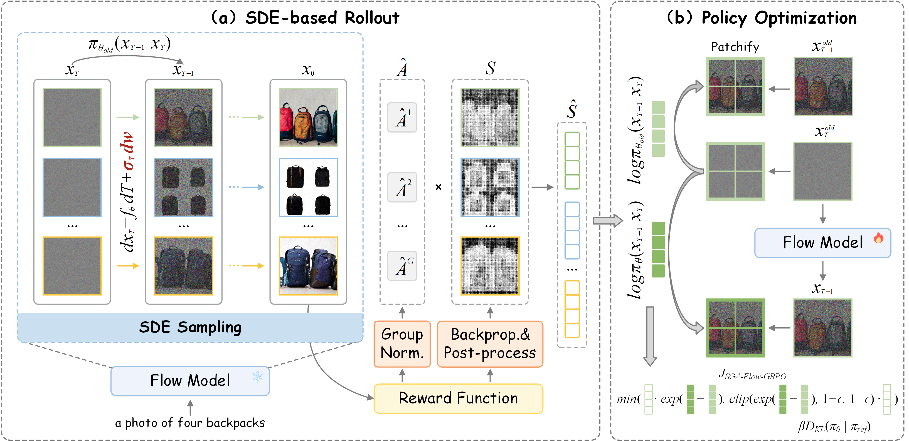

<h1 align="center">
SGA-Flow-GRPO:<br>
Spatial Gradient-Guided Credit Assignment for Flow-GRPO
</h1>

<div align="center">
  <a href='https://arxiv.org/abs/2609.32340'></a>
</div>

<p align="center">
Yunkai Yang,
<a href="https://yudongzhang.com/">Yudong Zhang</a>,
Xinying Chen,
Bin Luo,
Jienan Lyu,
Kunquan Zhang,
Weitao Wan,
<a href="https://dongrunmin.github.io/">Runmin Dong</a><sup>*</sup>
</p>

<p align="center">
Sun Yat-sen University & Baidu & Tsinghua University & TS Martech
</p>

## Overview

<p align="center">
  
</p>

SGA-Flow-GRPO contains two complementary components:

1. **Token-wise likelihood representation.** The transition-level likelihood in Flow-GRPO is reformulated into a token-wise representation aligned with the spatial patch structure of the diffusion transformer. This produces spatially fine-grained importance ratios for policy optimization.
2. **Reward-gradient spatial credit.** A differentiable reward is backpropagated to the generated image and converted into a continuous spatial credit map. Median Absolute Deviation (MAD) normalization and temperature scaling reduce outliers and stabilize the credit signal.

The resulting spatial credit is used to modulate the group-relative advantage during GRPO optimization, allowing prompt-relevant regions to receive more informative policy updates.

## Environment Setup

The environment follows the setup used by [DiffusionNFT](https://github.com/NVlabs/DiffusionNFT) and the surrounding Flow-GRPO ecosystem.

```bash
conda create -n sga-flow-grpo python=3.10.16 -y
conda activate sga-flow-grpo

pip install torch==2.6.0 torchvision==0.21.0 --index-url https://download.pytorch.org/whl/cu126
pip install -e .
```

The base model used in the paper is:

```text
stabilityai/stable-diffusion-3.5-medium
```

Before training, make sure that the model is accessible from your Hugging Face environment and that the CUDA driver supports the installed PyTorch build.


### Reward environments

Install the additional packages required by the rewards used in your experiment:

```bash
# GenEval
pip install -U openmim
mim install mmengine
git clone https://github.com/open-mmlab/mmcv.git
cd mmcv; git checkout 1.x
MMCV_WITH_OPS=1 FORCE_CUDA=1 pip install -e . -v
cd ..

git clone https://github.com/open-mmlab/mmdetection.git
cd mmdetection; git checkout 2.x
pip install -e . -v
cd ..

pip install open-clip-torch clip-benchmark

# ImageReward
pip install image-reward
pip install git+https://github.com/openai/CLIP.git

# OCR
pip install paddlepaddle-gpu==2.6.2
pip install paddleocr==2.9.1
pip install python-Levenshtein
```

### Reward Checkpoints

```bash
mkdir reward_ckpts
cd reward_ckpts
# GenEval
wget https://download.openmmlab.com/mmdetection/v2.0/mask2former/mask2former_swin-s-p4-w7-224_lsj_8x2_50e_coco/mask2former_swin-s-p4-w7-224_lsj_8x2_50e_coco_20220504_001756-743b7d99.pth
cd ..
```
Then modify the corresponding configuration in `reward_server\reward_server\gen_eval.py`.

### Weights & Biases

The training script logs metrics and generated samples with Weights & Biases:

```bash
wandb login
```

Alternatively, adapt the logging section of `scripts/train_sga_grpo.py` for offline or local logging.


## Training

The default launcher uses the Accelerate multi-GPU configuration:

```bash
bash train.sh
```

Equivalent command:

```bash
accelerate launch \
  --config_file accelerate_configs/multi_gpu.yaml \
  --num_processes 8 \
  --main_process_port 19961 \
  scripts/train_sga_grpo.py \
  --config config/sga_grpo.py:geneval_sga_grpo
```

For the PickScore preset:

```bash
accelerate launch \
  --config_file accelerate_configs/multi_gpu.yaml \
  --num_processes 8 \
  --main_process_port 19961 \
  scripts/train_sga_grpo.py \
  --config config/sga_grpo.py:pickscore_sga_grpo
```

Before changing the number of GPUs, update both the launch command and the GPU-dependent batch/group calculations in `config/sga_grpo.py`. In particular, the supplied configurations require `sample.num_batches_per_epoch` to remain even.


## Acknowledgements

This project builds on the [Flow-GRPO](https://github.com/yifan123/flow_grpo) and [DiffusionNFT](https://github.com/NVlabs/DiffusionNFT)  codebases and the open-source ecosystems of PyTorch, Diffusers, Accelerate, PEFT, and Weights & Biases.

## Citation

If you find SGA-Flow-GRPO useful for your research, welcome to 🌟 this repo and cite our work using the following BibTeX:

```bibtex
@article{yang2026sga_flow_grpo,
      title={SGA-Flow-GRPO: Spatial Gradient-Guided Credit Assignment for Flow-GRPO}, 
      author={Yunkai Yang and Yudong Zhang and Xinying Chen and Bin Luo and Jienan Lyu and Kunquan Zhang and Weitao Wan and Runmin Dong},
      year={2026},
      eprint={2609.32340},
      archivePrefix={arXiv},
      primaryClass={cs.CV},
      url={https://arxiv.org/abs/2609.32340}, 
}
```
